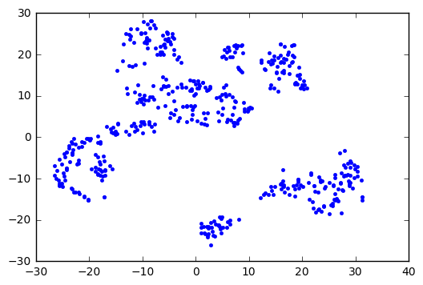

# t-SNEでやりたいこと

t-SNEでは以下の3点を調べる．

1. 理論面の理解
2. 画像処理(の実装)の理解
3. 実際に何に使えるか


## Stochastic Neighbor Embedding
Stochastic Neighbor Embedding (SNE)は高次元($\mathbb{R}^n$)のデータを
に対し,類似度を定めるアルゴリズムである．類似度は各点の距離の遠さを確率分布を用いて，低次元に表現したものである．
$x_i,x_j \in \mathbb{R}^n$の類似度を与える条件付き，確率 $p_{j|i}$を以下で定める．

$$ p_{j|i} = \frac{ \mathrm{exp}(−||x_i −x_j ||^2/2σ^2_i)}
  {\sum_{k \neq i} \mathrm{exp}(−||x_i −x_k||^2/2σ^2_i)}
$$
where $\sigma_i$ is the variance of the Gaussian that is centered on datapoint $x_i$. The method for determining
the value of $\sigma_i$ is presented later in this section.
Because we are only interested in modeling pairwise
similarities, we set the value of $p_{i|i}$ to zero.
For the low-dimensional counterparts $y_i$ and $y_j$ of the
high-dimensional datapoints $x_i$ and $x_j$,
it is possible to compute a similar conditional probability,
which we denote by $q_{j|i}$.
We set the variance of the Gaussian that is employed in the computation
of the conditional probabilities $q_{j|i}$ to $\frac{1}{\sqrt{2}}$.
Hence, we model the similarity of map point $y_j$ to map point $y_i$ by
$$
q_{j|i} =
\frac{                  \mathrm{exp}(−||y_i −y_j||^2)}
{\sum_{k \neq i} \mathrm{exp}(−||y_i −y_k||^2)}.
$$
Again, since we are only interested in modeling pairwise similarities, we set $q_{i|i} = 0$.
SNE aims to find a low-dimensional data representation that minimizes the mismatch between $p_{j|i}$ and $q_{j|i}$.
A natural(なぜ??) measure of the faithfulness(??) with which $q_{j|i}$ models $p_{j|i}$ is the KullbackLeibler divergence (which is in this case equal to the cross-entropy up to an additive constant).
SNE minimizes the sum of Kullback-Leibler divergences over all datapoints using a gradient descent method. The cost function C is given by

$$ C = \sum_i KL(P_i||Q_i) = \sum_i \sum_j p_{j|i}
\mathrm{log}\frac{p_{j|i}}{q_{j|i}}
$$
in which $P_i$ represents the conditional probability distribution over all other datapoints given datapoint $x_i$,
and $Q_i$ represents the conditional probability distribution over all other map points given map point $y_i$.($y_i$も与えられているなら何が未知なんだろうか…．後$p_{i|i}=q_{j|j}=0$だが，そこは定義は…？まぁ0にするんでしょうけど．)
Because the Kullback-Leibler divergence is not symmetric, different types of error in the pairwise distances in the low-dimensional map are not weighted equally. In particular, there is a large cost for using widely separated map points to represent nearby datapoints (i.e., for using
a small $q_{j|i}$ to model a large $p_{j|i}$,

  The remaining parameter to be selected is the variance $\sigma_i$ of the Gaussian that is centered over each high-dimensional datapoint, $x_i$
  . It is not likely that there is a single value of $\sigma_i$ that is optimal for all datapoints in the data set because the density of the data is likely to vary. In dense regions, a smaller value of $\sigma_i$
  is usually more appropriate than in sparser regions. Any particular value of $\sigma_i$ induces a probability distribution, $P_i$, over all of the other datapoints. This distribution has an
  entropy which increases as $\sigma_i$ increases.
  SNE performs a binary search for the value of σi
  that
  produces a Pi with a fixed perplexity that is specified by the user.
  The perplexity is defined as
$$ Perp(P_i) = 2^H(P_i) $$
  ,where $H(P_i)$ is the Shannon entropy of $P_i$ measured in bits
$$ H(P_i) = − \sum_j p_{j|i}\mathrm{log}_2p_{j|i} $$
  The perplexity can be interpreted as a smooth measure of the effective number of neighbors(よくわからない．). The
  performance of SNE is fairly robust to changes in the perplexity, and typical values are between 5　and 50.
  The minimization of the cost function in Equation 2 is performed using a gradient descent
  method. The gradient has a surprisingly simple form
  $$
  \frac{ \delta C}{ \delta y_i}
  = 2\sum_j (p_{j|i} −q_{j|i} + p_{i|j} −q_{i|j})(y_i −y_j).
  $$
  the map point $y_i$ and all other map points $y_j$
  . All springs exert a force along the direction ($y_i$ −$y_j$).
  The spring between $y_i$ and $y_j$ repels or attracts the map points depending on whether the distance
  between the two in the map is too small or too large to represent the similarities between the two
  high-dimensional datapoints. The force exerted by the spring between $y_i$ and $y_j$
  is proportional to its
  length, and also proportional to its stiffness, which is the mismatch
  ($p_{j|i} − q_{j|i}$ + $p_{i|j} − q_{i| j}$) between
  the pairwise similarities of the data points and the map points.
  The gradient descent is initialized by sampling map points randomly from an isotropic Gaussian
  with small variance that is centered around the origin. In order to speed up the optimization and to
  avoid poor local minima, a relatively large momentum term is added to the gradient. In other words,
  the current gradient is added to an exponentially decaying sum of previous gradients in order to
  determine the changes in the coordinates of the map points at each iteration of the gradient search.
  Mathematically, the gradient update with a momentum term is given by
  $$ \gamma(t) = \gamma(t−1) +η
  \frac{δC}{δY} +α(t)(\gamma(t−1) −\gamma(t−2))
$$


## 実装例
```python
import numpy as np
from sklearn import datasets
from sklearn.manifold import TSNE
from matplotlib import pyplot as plt


boston = datasets.load_boston()
model = TSNE(n_components=2)
tsne_result = model.fit_transform(boston.data)
plt.plot(tsne_result[:,0], tsne_result[:,1], ".")
plt.show()
```



